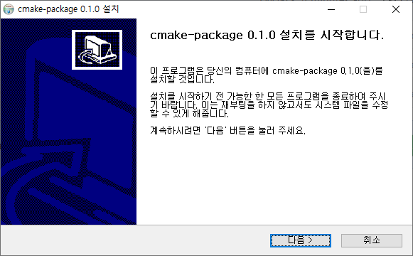

# Example-CMake-Package
CMake + CPack + NSIS를 이용해서 Windows 환경에서 설치파일을 만드는 예제입니다.

## 예제
~~~powershell
$ mkdir build
$ cd build
$ cmake --build . --config Release
$ cmake --build . --target pacakge
~~~